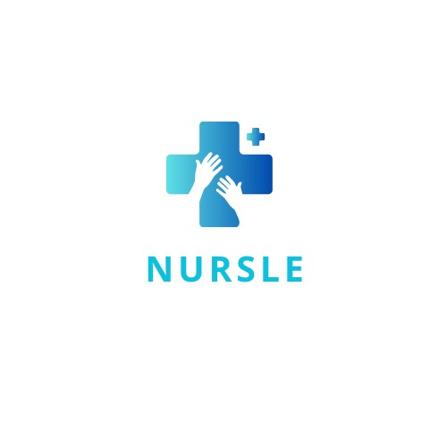

# Nursle - Medical Triage Application



**Nursle** is a full-stack medical triage application designed to streamline healthcare workflows by enabling nurses and healthcare professionals to manage patient information, perform basic triage assessments, and maintain secure authentication sessions.

## 🩺 About Nursle

Nursle combines modern web technologies to provide an intuitive interface for medical professionals to:
- Securely register and authenticate healthcare staff
- Input and manage patient information
- Perform basic triage assessments
- Access personalized dashboards
- Utilize AI-powered voice assistance for patient data collection

## ✨ Core Features

### 🔐 Authentication & Security
- **Secure Registration**: Healthcare professionals can create accounts with email verification
- **Session-based Authentication**: Secure login system with password hashing
- **Protected Routes**: Role-based access control for sensitive medical data
- **Nurse ID Validation**: Professional verification through unique nurse identifiers

### 👨‍⚕️ User Management
- **Professional Profiles**: Full name, email, and nurse ID management
- **Dashboard Access**: Personalized workspace for each healthcare professional
- **Session Management**: Secure logout and session handling

### 🏥 Patient Triage System
- **Patient Information Forms**: Comprehensive data collection for name, age, gender, and symptoms
- **Triage Assessments**: Basic medical triage logic and recommendations
- **Results Display**: Clear presentation of triage outcomes and next steps

### 🎨 User Experience
- **Responsive Design**: Optimized for desktop, tablet, and mobile devices
- **Dark/Light Mode**: Adaptive theming for different working environments
- **Smooth Animations**: Framer Motion-powered transitions for enhanced UX
- **Accessibility**: WCAG-compliant design patterns

### 🤖 AI Integration (Beta)
- **Voice Input**: AI-powered voice assistant for patient data collection
- **OpenAI Integration**: Natural language processing for symptom analysis
- **ElevenLabs Integration**: Text-to-speech capabilities for accessibility

## 🚀 Quick Start

### Prerequisites
- Node.js 18+ 
- Python 3.11+
- PostgreSQL database

### Installation

1. **Clone and Setup**
   ```bash
   git clone <repository-url>
   cd nursle-project
   ```

2. **Using Docker Compose (Recommended)**
   ```bash
   cd Nursle-final
   docker-compose up --build
   ```

3. **Manual Setup**
   
   **Backend Setup:**
   ```bash
   cd Nursle-final/backend
   pip install -r requirements.txt
   python init_db.py
   python seed.py
   python app.py
   ```
   
   **Frontend Setup:**
   ```bash
   cd Nursle-final/frontend
   npm install
   npm run dev
   ```

### Access Points
- **Frontend**: http://localhost:5173 (development) | http://localhost:5000 (production)
- **Backend API**: http://localhost:8000

### Demo Account
- **Email**: nurse@example.com
- **Password**: NURSE123
- **Nurse ID**: NURSE123

## 🛠 Technology Stack

### Frontend
- **React 18** - Modern UI framework with hooks and context
- **React Router** - Client-side navigation and routing
- **Vite 5.x** - Fast build tool and development server
- **Tailwind CSS** - Utility-first CSS framework
- **Framer Motion** - Animation library for smooth transitions
- **OpenAI API** - AI-powered features integration

### Backend
- **Flask** - Lightweight Python web framework
- **SQLAlchemy** - Database ORM and migration management
- **PostgreSQL** - Primary database system
- **Flask-Session** - Server-side session management
- **Werkzeug** - Password hashing and security utilities
- **Flask-CORS** - Cross-origin resource sharing support
- **Gunicorn** - Production WSGI server

### DevOps & Deployment
- **Docker & Docker Compose** - Containerization for consistent environments
- **Replit Deployment** - Cloud hosting and continuous deployment
- **Environment Variables** - Secure configuration management

## 📡 API Documentation

### Base URL
```
http://localhost:8000/api
```

### Authentication Endpoints

#### POST /api/signup
Register a new healthcare professional.

**Request Body:**
```json
{
  "full_name": "Jane Doe",
  "email": "jane.doe@hospital.com",
  "nurse_id": "NURSE456",
  "password": "securepassword123"
}
```

**Response (201):**
```json
{
  "message": "Signup successful"
}
```

**Error Response (400):**
```json
{
  "error": "Email already registered"
}
```

#### POST /api/login
Authenticate an existing user.

**Request Body:**
```json
{
  "email": "jane.doe@hospital.com",
  "password": "securepassword123"
}
```

**Response (200):**
```json
{
  "message": "Login successful",
  "first_name": "Jane"
}
```

**Error Response (401):**
```json
{
  "error": "Invalid credentials"
}
```

### User Dashboard

#### GET /api/dashboard
Retrieve authenticated user's dashboard information.

**Headers:**
```
Cookie: session=<session_id>
```

**Response (200):**
```json
{
  "first_name": "Jane",
  "email": "jane.doe@hospital.com"
}
```

**Error Response (401):**
```json
{
  "error": "Unauthorized"
}
```

### Error Handling
All API endpoints return consistent error responses with appropriate HTTP status codes:
- **400**: Bad Request (validation errors, duplicate data)
- **401**: Unauthorized (authentication required)
- **404**: Not Found (resource doesn't exist)
- **500**: Internal Server Error (server-side issues)

## 🔮 Future Enhancements

### 🏥 Advanced Medical Features
- **Electronic Health Records (EHR) Integration**: Connect with existing hospital systems
- **Medical History Tracking**: Comprehensive patient timeline and medical history
- **Symptom Checker AI**: Advanced AI-powered diagnostic assistance
- **Drug Interaction Checker**: Real-time medication compatibility verification
- **Vital Signs Monitoring**: Integration with IoT medical devices

### 👥 Collaboration & Communication
- **Multi-user Chat System**: Real-time communication between healthcare teams
- **Shift Management**: Schedule coordination and handoff documentation
- **Patient Assignment System**: Automated patient-to-nurse allocation
- **Emergency Alerts**: Critical patient status notifications
- **Telemedicine Integration**: Video consultation capabilities

### 📊 Analytics & Reporting
- **Triage Analytics Dashboard**: Performance metrics and patient flow analysis
- **Predictive Healthcare Analytics**: AI-powered patient outcome predictions
- **Resource Utilization Reports**: Hospital capacity and efficiency tracking
- **Quality Metrics**: Patient satisfaction and care quality indicators
- **Compliance Reporting**: HIPAA and regulatory compliance automation

### 🔗 System Integrations
- **Hospital Information System (HIS) Integration**: Seamless data exchange
- **Laboratory Results Integration**: Real-time lab report access
- **Pharmacy Management System**: Prescription and medication tracking
- **Imaging System Integration**: X-ray, MRI, and CT scan access
- **Insurance Verification API**: Real-time coverage validation

### 📱 Mobile & Accessibility
- **Progressive Web App (PWA)**: Offline functionality and mobile app experience
- **Mobile-first Responsive Design**: Optimized for smartphones and tablets
- **Voice Commands**: Hands-free operation for sterile environments
- **Multi-language Support**: Internationalization for diverse healthcare teams
- **Accessibility Enhancements**: Screen reader support and keyboard navigation

### 🔒 Security & Compliance
- **Two-Factor Authentication (2FA)**: Enhanced security for medical data access
- **HIPAA Compliance Tools**: Automated privacy and security controls
- **Audit Logging**: Comprehensive activity tracking for compliance
- **Data Encryption**: End-to-end encryption for sensitive medical information
- **Role-based Access Control (RBAC)**: Granular permission management

## 🏗 Project Structure

```
Nursle-final/
├── backend/
│   ├── app.py              # Flask application entry point
│   ├── models.py           # Database models and schemas
│   ├── init_db.py          # Database initialization script
│   ├── seed.py             # Development data seeding
│   └── requirements.txt    # Python dependencies
├── frontend/
│   ├── src/
│   │   ├── components/     # Reusable UI components
│   │   ├── pages/          # Application pages/routes
│   │   ├── contexts/       # React context providers
│   │   └── api/            # API client configuration
│   ├── package.json        # Node.js dependencies
│   └── vite.config.js      # Build configuration
└── docker-compose.yml      # Development environment setup
```

## 🤝 Contributing

1. Fork the repository
2. Create a feature branch (`git checkout -b feature/amazing-feature`)
3. Commit your changes (`git commit -m 'Add amazing feature'`)
4. Push to the branch (`git push origin feature/amazing-feature`)
5. Open a Pull Request

## 📄 License

This project is licensed under the MIT License - see the [LICENSE](LICENSE) file for details.

## 👨‍💻 Development Team

**Created by James Kagua (litmajor)**

## 🆘 Support

For support and questions:
- Create an issue in the repository
- Contact the development team
- Check the documentation for common solutions

---

**Nursle** - Streamlining healthcare through technology 🏥✨
